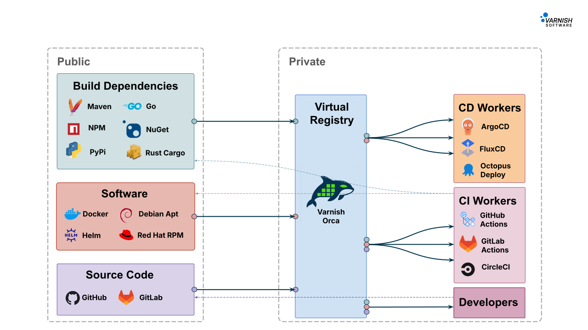

# Varnish Orca Documentation

Welcome to the documentation for **Varnish Orca**. This documentation will help you install, configure, and operate Varnish Orca in your environment.

- [Getting Started](../README.md#getting-started)
- [Installation](./installation.md)
  - [Docker](./installation.md#docker)
  - [Docker Compose](./installation.md#docker-compose)
  - [Debian/Ubuntu](./installation.md#install-on-debianubuntu)
  - [RHEL/CentOS](./installation.md#install-on-rhelcentos)
- [Default Configuration](./default-configuration.md)
- [Tutorials](./tutorials/README.md)
  - [Dokcer Cache](./tutorials/docker-cache.md)
- [Configuration Reference](./configuration/README.md)
  - [Virtual Registry](./configuration/virtual-registry.md)
  - [Remotes](./configuration/remotes.md)
  - [Supervisor](./configuration/supervisor.md)
  - [Varnish](./configuration/varnish.md)
  - [Varnish Parameters](./configuration/varnish-params.md)
  - [ACME TLS](./configuration/acme.md)
  - [OpenTelemetry](./configuration/otel.md)
  - [License](./configuration/license.md)

